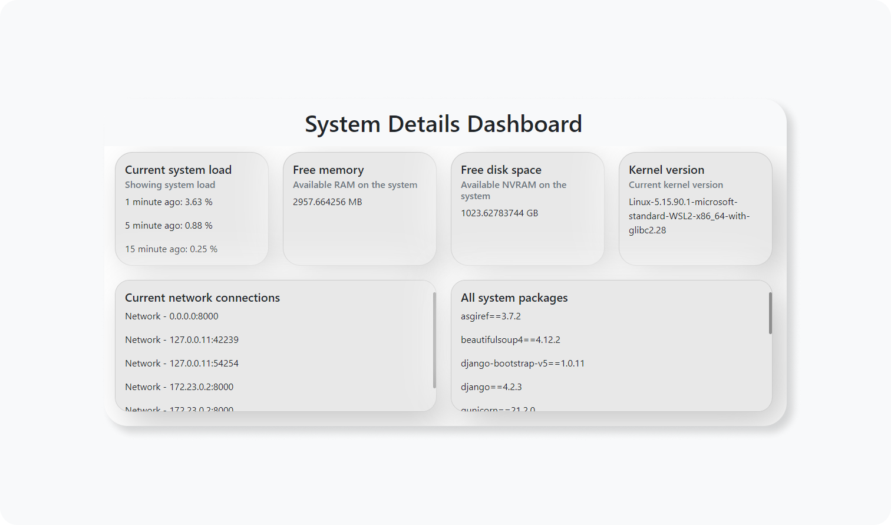

# linux-miniwebsite

A simple mini website that shows the host computer's details such as cpu usage, available ram, available disk space etc.
This project was done in django and is hosted from a machine running Ubuntu 22.04 WSL from Windows 10.

***Note that this project was only tested from an ubuntu machine as I could not get it to work in windows*** \
***Note this project assumes you already have python3 installed***

# Presentation


# Setup

### To setup this project on your machine in dev mode:
1. Download <a href="https://www.docker.com/">docker</a> and launch the application and leave it launched
2. Clone this repo
3. Open a new terminal in the project directory and run ```source ./rundev.sh```. This will install all neccessary dependencies, create a virtual environment and start up a live server at ```localhost:8000``` for you. It may take some time to finish setting up.
4. To close the project, in the terminal of the project directory, run ```source ./closedev.sh```. This will deactivate the virtual environment and stop the server from being hosted.
5. If you see something like ": command not found" in your terminal when you run any of the bash files, then it means the bash files have to be converted from DOS to Unix format, so instead run for example,```dos2unix -b <filename>.sh && source ./<filename>.sh```. For more details about this, see the section under Optional Extras-> Convert a bash script from DOS to Unix, at the end of this README file.

### To setup this project on your machine in production mode:

1. Download <a href="https://www.docker.com/">docker</a> and launch the application and leave it launched
2. Clone this repo
3. Assuming you have already created a virtual environment folder, that is miniwebsite_venv already exists(if not just run ```python3 -m venv miniwebsite_venv && source ./run_prod.sh``` in your terminal instead), Open a new terminal in the project directory and run ```source ./run_prod.sh```. This will install all neccessary dependencies and start up a live server at ```localhost:8000``` for you.
4. To close the project, in the terminal of the project directory, run ```source ./close_prod.sh```. This will deactivate the virtual environment and stop the server from being hosted.
5. If you see something like ": command not found" in your terminal when you run any of the bash files, then it means the bash files have to be converted from DOS to Unix format, so instead run for example,```dos2unix -b <filename>.sh && source ./<filename>.sh```. For more details about this, see the section under Optional Extras-> Convert a bash script from DOS to Unix, at the end of this README file.

# Optional Extras
### Convert a bash script from DOS to Unix
1. If you try to run the project from WSL 2, sometimes it may fail and give errors such as command not found even though the bash scripts are very correct. I found out it is because linux cannot interpret windows paths so you have to convert the bash script from DOS to Unix. This <a href="https://phoenixnap.com/kb/convert-dos-to-unix#:~:text=one%2Dliner%20command-,Option%201%3A%20Converting%20DOS%20to%20UNIX%20with%20dos2unix%20Command,to%20use%20the%20dos2unix%20tool.&text=The%20command%20converts%20the%20file,attribute%20before%20the%20file%20name.">website</a> provides the details but the general gist is to just run  ```dos2unix -b <name of file you want to convert goes here>``` in the cmd.
2. I have listed the bash files that would need to be converted from DOS to Unix format(these commands will only need to be ran once, unless you edit the bash files again).
3. ```dos2unix -b rundev.sh && source ./rundev.sh```(in project's root dir)
4. ```dos2unix -b closedev.sh && source ./closedev.sh```(in the miniwebsite dir)
5. ```dos2unix -b run_prod.sh && source ./run_prod.sh```(in project's root dir)
6. ```dos2unix -b close_prod.sh && source ./close_prod.sh```(in project's root dir)

### Regenerate rquirements file:
1. ```pip freeze > requirements.txt``` will regenerate a new requirements.txt file. Invoke this command in a virtual environment which can be invoked by running ```source miniwebsite_venv/bin/activate``` in the root of the project then ```cd miniwebsite``` then run ```pip freeze > requirements.txt```.

### Run server with django:
1. ```python manage.py runserver``` will start a server at ```localhost:8000```. Run this command in the miniwebsite directory where manage.py is.

### run server with gunicorn:
1. ```gunicorn miniwebsite.wsgi --timeout 180``` will start a server at ```localhost:8000```. I included --timeout because my computer takes time to start the server.
